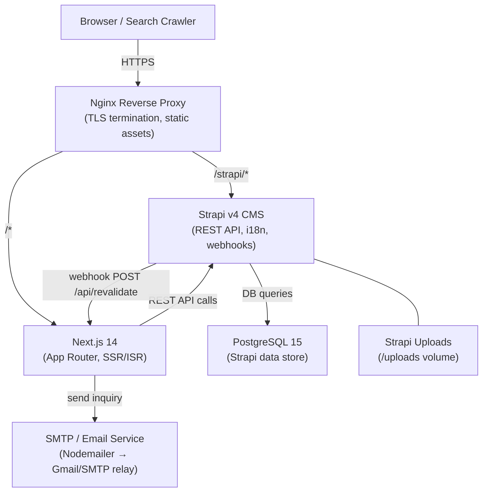
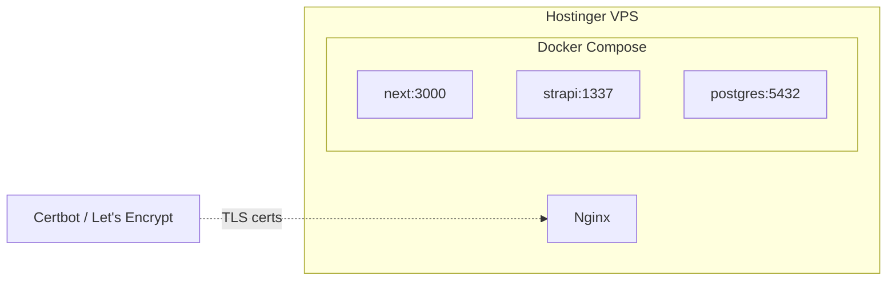
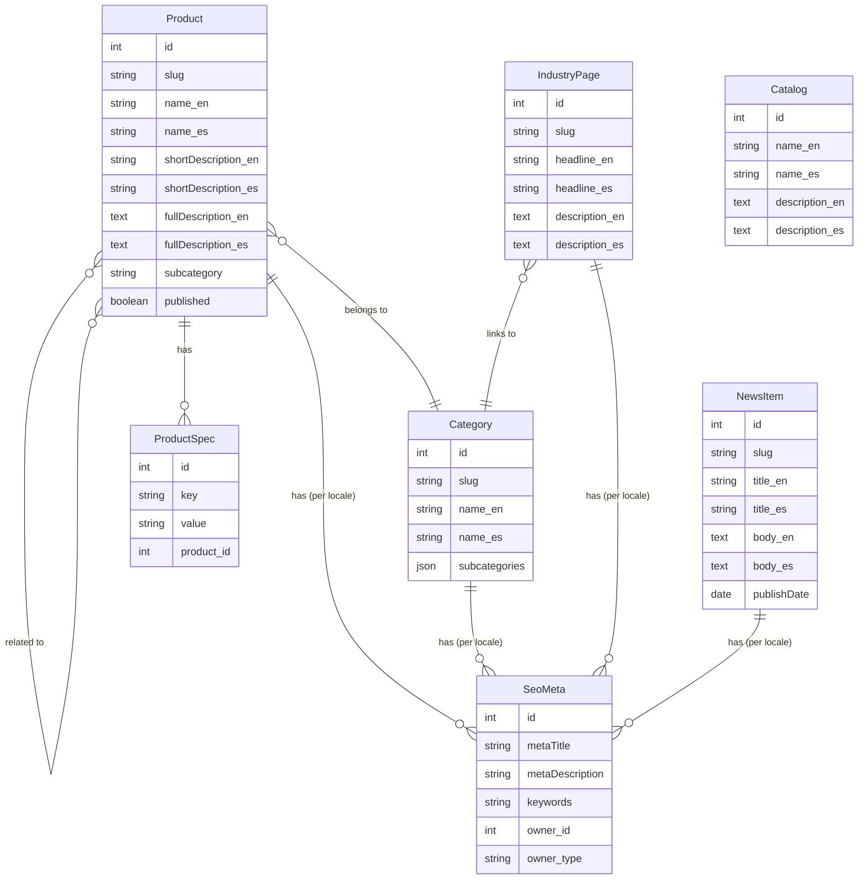

# Design Document: Jiayi Tools Website

## Overview

The Jiayi Tools website is a multilingual, SEO-first B2B marketing and product catalog platform for a Shenzhen-based carbide cutting tools manufacturer. The system is composed of two independently deployable services:

- **Next.js 14 frontend** — server-side rendered, locale-aware, consuming Strapi via REST API
- **Strapi v4 CMS** — headless content management with i18n plugin, webhooks, and Draft & Publish

Both services run in Docker containers on a Hostinger VPS, with PostgreSQL as the persistence layer for Strapi and Nginx as the reverse proxy. The frontend communicates with Strapi exclusively over the internal Docker network; the public internet only reaches Nginx.

### Key Design Goals

1. **SEO-first**: All pages are server-rendered; no product content is loaded client-side only
2. **CMS-driven**: No content is hardcoded in the frontend; all copy, metadata, and navigation labels come from Strapi
3. **Sub-60-second revalidation**: Strapi webhooks trigger Next.js `revalidatePath` / `revalidateTag` so stale pages are rebuilt within the SLA
4. **Multilingual from day one**: The `[locale]` dynamic segment and `next-intl` library handle all routing and translation lookups
5. **Independently deployable**: Next.js and Strapi containers can be updated without a full-stack redeploy

---

## Architecture

### High-Level Component Diagram



### Request Flow

**Page request (visitor)**:
1. Browser → Nginx (TLS) → Next.js App Router
2. Next.js checks Next.js cache (ISR cache); on hit, returns cached HTML immediately
3. On cache miss, Next.js calls Strapi REST API (`fetch` with `next: { tags: [...] }`)
4. HTML rendered server-side, returned to browser

**Content update (admin publishes in Strapi)**:
1. Strapi fires webhook POST to `https://<domain>/api/revalidate`
2. Next.js route handler validates secret, calls `revalidateTag(tag)` or `revalidatePath(path)`
3. Next cached entries for the affected pages are purged; next visitor request triggers a fresh render

### Deployment Topology



---

## Components and Interfaces

### 1. Next.js App Router Structure

```
app/
├── [locale]/                          # dynamic segment: "en" | "es"
│   ├── layout.tsx                     # root locale layout (providers, nav, footer)
│   ├── page.tsx                       # Home Page
│   ├── about/
│   │   ├── company-profile/page.tsx
│   │   ├── rd-manufacturing/page.tsx
│   │   └── news/page.tsx
│   ├── products/
│   │   ├── page.tsx                   # Products overview / category listing
│   │   ├── [categorySlug]/
│   │   │   ├── page.tsx               # Category Page
│   │   │   └── [productSlug]/
│   │   │       └── page.tsx           # Individual Product Page
│   ├── industries/
│   │   └── [industrySlug]/page.tsx    # Industry Application Page
│   ├── services/
│   │   ├── career/page.tsx
│   │   ├── cooperate/page.tsx
│   │   ├── events/page.tsx
│   │   ├── technology/page.tsx
│   │   └── catalogs/page.tsx
│   └── contact/page.tsx
├── api/
│   └── revalidate/route.ts            # Strapi webhook handler
├── sitemap.ts                         # Dynamic sitemap (all locales)
├── robots.ts
└── middleware.ts                      # Locale detection & redirect
```

**Locale routing with `next-intl`**:

- `middleware.ts` uses `next-intl`'s `createMiddleware` to detect locale from the path prefix, cookie, or `Accept-Language` header, and redirects bare `/` → `/en/`
- All pages under `app/[locale]/` receive `params.locale` and pass it to every Strapi API call
- Translation strings (UI labels, nav items, button text, error messages) are stored in `messages/en.json` and `messages/es.json` in the frontend repo; product content itself comes from Strapi

### 2. Strapi CMS Content Types

#### Product (collection type, i18n enabled)

| Field | Type | Localized | Notes |
|---|---|---|---|
| `name` | String | ✓ | Required |
| `slug` | UID (from `name`) | ✗ | Unique per collection |
| `category` | Relation → Category | ✗ | Many-to-one |
| `subcategory` | String | ✓ | e.g. "Carbide Drill Bit" |
| `shortDescription` | Text (max 160) | ✓ | Used in category listing cards |
| `fullDescription` | Rich text | ✓ | |
| `specifications` | Component (key-value repeater) | ✓ | |
| `images` | Media (multiple) | ✗ | |
| `specificationSheet` | Media (single PDF) | ✗ | Optional |
| `coatings` | String (repeater) | ✓ | |
| `compatibleMaterials` | String (repeater) | ✓ | |
| `seo` | Component → SeoMeta | ✓ | |
| `relatedProducts` | Relation → Product (self) | ✗ | Many-to-many |

#### Category (collection type, i18n enabled)

| Field | Type | Localized |
|---|---|---|
| `name` | String | ✓ |
| `slug` | UID | ✗ |
| `description` | Text | ✓ |
| `subcategories` | JSON / component list | ✓ |
| `seo` | Component → SeoMeta | ✓ |

#### IndustryPage (collection type, i18n enabled)

| Field | Type | Localized |
|---|---|---|
| `name` | String | ✓ |
| `slug` | UID | ✗ |
| `headline` | String | ✓ |
| `description` | Rich text | ✓ |
| `image` | Media | ✗ |
| `relatedCategory` | Relation → Category | ✗ |
| `seo` | Component → SeoMeta | ✓ |

#### NewsItem (collection type, i18n enabled)

| Field | Type | Localized |
|---|---|---|
| `title` | String | ✓ |
| `slug` | UID | ✗ |
| `body` | Rich text | ✓ |
| `publishDate` | Date | ✗ |
| `coverImage` | Media | ✗ |
| `seo` | Component → SeoMeta | ✓ |

#### Catalog (collection type, i18n enabled)

| Field | Type | Localized |
|---|---|---|
| `name` | String | ✓ |
| `description` | Text | ✓ |
| `coverThumbnail` | Media | ✗ |
| `pdfFile` | Media | ✗ |

#### SeoMeta (component, reusable)

| Field | Type |
|---|---|
| `metaTitle` | String (max 70) |
| `metaDescription` | String (max 160) |
| `keywords` | Text |

### 3. API Integration Layer (`lib/strapi.ts`)

The frontend wraps all Strapi calls in a typed module. Key design decisions:

- Uses native `fetch` (not Axios) to benefit from Next.js request memoization and cache tagging
- Every fetch is tagged with cache tags for selective revalidation
- A shared `getStrapiURL()` utility reads `STRAPI_API_URL` from env; internally it points to `http://strapi:1337` (Docker network); externally to `https://<domain>/strapi`

```typescript
// lib/strapi.ts (interface sketch)

export async function getProducts(locale: string, categorySlug?: string, page = 1) {
  const url = buildUrl('/api/products', {
    locale,
    populate: ['images', 'category', 'seo'],
    filters: categorySlug ? { category: { slug: { $eq: categorySlug } } } : undefined,
    pagination: { page, pageSize: 24 },
    publicationState: 'live',
  });
  return fetch(url, { next: { tags: ['products', `products-${categorySlug}`] } });
}

export async function getProductBySlug(slug: string, locale: string) {
  const url = buildUrl(`/api/products`, {
    locale,
    filters: { slug: { $eq: slug } },
    populate: ['images', 'specificationSheet', 'specifications',
               'category', 'relatedProducts.images', 'seo'],
    publicationState: 'live',
  });
  return fetch(url, { next: { tags: [`product-${slug}`] } });
}

export async function revalidateByWebhook(event: StrapiWebhookEvent) {
  // Called from /api/revalidate route handler
  // Maps event.model + event.entry.slug to cache tags
}
```

**Strapi REST API query pattern** (using `qs` serialization):
```
GET /api/products?locale=en&populate[0]=images&populate[1]=category
  &filters[category][slug][$eq]=hole-making
  &pagination[page]=1&pagination[pageSize]=24
  &publicationState=live
```

### 4. Revalidation Webhook Handler

`app/api/revalidate/route.ts` receives Strapi lifecycle webhooks:

```typescript
// POST /api/revalidate
// Headers: x-revalidate-secret: <REVALIDATE_SECRET>
export async function POST(request: Request) {
  const secret = request.headers.get('x-revalidate-secret');
  if (secret !== process.env.REVALIDATE_SECRET) return new Response('Unauthorized', { status: 401 });

  const body: StrapiWebhookPayload = await request.json();
  const { event, model, entry } = body;

  if (['entry.publish', 'entry.unpublish', 'entry.update', 'entry.delete'].includes(event)) {
    switch (model) {
      case 'product':
        revalidateTag('products');
        revalidateTag(`products-${entry.category?.slug}`);
        revalidateTag(`product-${entry.slug}`);
        break;
      case 'category':
        revalidateTag('categories');
        revalidateTag(`products-${entry.slug}`);
        break;
      case 'industry-page':
        revalidateTag('industries');
        revalidateTag(`industry-${entry.slug}`);
        break;
      case 'news-item':
        revalidateTag('news');
        break;
      case 'catalog':
        revalidateTag('catalogs');
        break;
    }
    revalidatePath('/sitemap.xml'); // keep sitemap fresh
  }
  return new Response('OK', { status: 200 });
}
```

Strapi is configured with a webhook pointing to `http://next:3000/api/revalidate` (internal Docker network) with the shared secret.

### 5. SEO Components

**`generateMetadata` per route** (Next.js Metadata API):
```typescript
export async function generateMetadata({ params }): Promise<Metadata> {
  const { locale, productSlug } = params;
  const product = await getProductBySlug(productSlug, locale);
  const seo = product.data[0]?.attributes?.seo;
  return {
    title: `${seo?.metaTitle ?? product.name} | JIAYI Tools`,
    description: seo?.metaDescription,
    keywords: seo?.keywords,
    alternates: {
      canonical: `/${locale}/products/${categorySlug}/${productSlug}`,
      languages: {
        'en': `/en/products/${categorySlug}/${productSlug}`,
        'es': `/es/products/${categorySlug}/${productSlug}`,
      },
    },
  };
}
```

**JSON-LD for Product pages** (inline `<script>` in server component):
```tsx
const jsonLd = {
  '@context': 'https://schema.org',
  '@type': 'Product',
  name: product.name,
  description: product.shortDescription,
  brand: { '@type': 'Brand', name: 'JIAYI Tools' },
  image: product.images[0]?.url,
  sku: product.slug,
};
<script
  type="application/ld+json"
  dangerouslySetInnerHTML={{ __html: JSON.stringify(jsonLd) }}
/>
```

**Dynamic sitemap** (`app/sitemap.ts`):
```typescript
export default async function sitemap(): Promise<MetadataRoute.Sitemap> {
  const [products, categories, industries] = await Promise.all([
    getAllProducts(), getAllCategories(), getAllIndustries()
  ]);
  const locales = ['en', 'es'];
  // Generate entries for each page × locale combination
  // Each entry includes lastmod and alternateRefs for hreflang
}
```

### 6. Inquiry Form and Email Delivery

The Inquiry Form is a React Client Component (`'use client'`) that submits to a Next.js API route:

- **Frontend validation**: `react-hook-form` + `zod` schema validates all fields client-side before submission
- **CAPTCHA**: Google reCAPTCHA v3 (invisible) token sent with form submission
- **API route** (`app/api/inquiry/route.ts`):
  1. Validates reCAPTCHA token against Google's `siteverify` endpoint
  2. Re-validates all fields with the same Zod schema (server-side)
  3. Sends notification email via Nodemailer (configured SMTP)
  4. Returns `200` with a success message or `422` with validation errors

**Email delivery**: Nodemailer with Gmail OAuth2 or a transactional SMTP relay (e.g. SMTP2GO). Credentials stored in environment variables, never in source.

### 7. Docker Compose Setup

```yaml
# docker-compose.yml (production)
services:
  postgres:
    image: postgres:15-alpine
    restart: unless-stopped
    volumes:
      - postgres_data:/var/lib/postgresql/data
    environment:
      POSTGRES_DB: strapi
      POSTGRES_USER: strapi
      POSTGRES_PASSWORD: ${POSTGRES_PASSWORD}

  strapi:
    build: ./strapi
    restart: unless-stopped
    depends_on:
      - postgres
    volumes:
      - strapi_uploads:/app/public/uploads
    environment:
      DATABASE_CLIENT: postgres
      DATABASE_HOST: postgres
      DATABASE_PORT: 5432
      DATABASE_NAME: strapi
      DATABASE_USERNAME: strapi
      DATABASE_PASSWORD: ${POSTGRES_PASSWORD}
      APP_KEYS: ${STRAPI_APP_KEYS}
      API_TOKEN_SALT: ${STRAPI_API_TOKEN_SALT}
      ADMIN_JWT_SECRET: ${STRAPI_ADMIN_JWT_SECRET}
      JWT_SECRET: ${STRAPI_JWT_SECRET}
      STRAPI_PLUGIN_I18N_INIT_LOCALE_CODE: en
    ports:
      - "1337:1337"   # only exposed to internal network; Nginx proxies /strapi/

  next:
    build: ./frontend
    restart: unless-stopped
    depends_on:
      - strapi
    environment:
      STRAPI_API_URL: http://strapi:1337
      STRAPI_API_TOKEN: ${STRAPI_API_TOKEN}
      REVALIDATE_SECRET: ${REVALIDATE_SECRET}
      NEXT_PUBLIC_RECAPTCHA_SITE_KEY: ${RECAPTCHA_SITE_KEY}
      RECAPTCHA_SECRET_KEY: ${RECAPTCHA_SECRET_KEY}
      SMTP_HOST: ${SMTP_HOST}
      SMTP_USER: ${SMTP_USER}
      SMTP_PASSWORD: ${SMTP_PASSWORD}
      INQUIRY_RECIPIENT: ${INQUIRY_RECIPIENT}
    ports:
      - "3000:3000"

  nginx:
    image: nginx:alpine
    restart: unless-stopped
    depends_on:
      - next
      - strapi
    volumes:
      - ./nginx/nginx.conf:/etc/nginx/nginx.conf:ro
      - /etc/letsencrypt:/etc/letsencrypt:ro
      - strapi_uploads:/var/www/uploads:ro
    ports:
      - "80:80"
      - "443:443"

volumes:
  postgres_data:
  strapi_uploads:
```

**Nginx configuration** routes traffic:
- `location /strapi/` → `http://strapi:1337/` (Strapi admin + public API)
- `location /uploads/` → serves the shared `strapi_uploads` volume directly (static files, no Node.js overhead)
- `location /` → `http://next:3000/` (Next.js)

TLS certificates are managed by Certbot / Let's Encrypt on the host and mounted read-only into Nginx.

### 8. Image Optimization

- All product images are stored in Strapi's upload folder (WebP conversion is handled by Next.js `<Image>`)
- Next.js `<Image>` component is configured to allow the Strapi hostname in `next.config.ts`:
  ```typescript
  images: {
    remotePatterns: [{ hostname: process.env.STRAPI_HOST }],
    formats: ['image/avif', 'image/webp'],
  }
  ```
- Images below the viewport fold use `loading="lazy"` (Next.js `<Image>` default)
- Hero and LCP-candidate images use `priority={true}` to generate `<link rel="preload">`
- Nginx serves the `/uploads/` path with `Cache-Control: public, max-age=604800, immutable` (7-day cache)

---

## Data Models

### Entity Relationship Diagram



### URL → Data Mapping

| URL Pattern | Data Source | SSR Strategy |
|---|---|---|
| `/[locale]/` | Home page — featured products, stats (Strapi single type) | SSR + ISR |
| `/[locale]/products/[categorySlug]` | Category + Products list | SSR + ISR (tag: `products-{slug}`) |
| `/[locale]/products/[categorySlug]/[productSlug]` | Single Product | SSR + ISR (tag: `product-{slug}`) |
| `/[locale]/industries/[industrySlug]` | IndustryPage | SSR + ISR (tag: `industry-{slug}`) |
| `/[locale]/about/news` | NewsItems list | SSR + ISR (tag: `news`) |
| `/[locale]/services/catalogs` | Catalogs list | SSR + ISR (tag: `catalogs`) |
| `/[locale]/contact` | Static form page | SSR (no ISR needed) |
| `/sitemap.xml` | All slugs from Strapi | Generated on every revalidation |

### Translation Fallback Logic

```typescript
// lib/i18n-fallback.ts
export function withLocaleFallback<T>(localizedData: T | null, fallback: T): T {
  if (!localizedData) {
    logger.warn(`Missing translation for locale; falling back to default`);
    return fallback;
  }
  return localizedData;
}
```

When a product has no Spanish translation, the frontend returns the English `attributes` object and logs a `WARN` to the server log. This satisfies requirement 6.6 (render English content, log warning).

---

## Correctness Properties

*A property is a characteristic or behavior that should hold true across all valid executions of a system — essentially, a formal statement about what the system should do. Properties serve as the bridge between human-readable specifications and machine-verifiable correctness guarantees.*

**PBT applicability assessment**: The Jiayi Tools website includes several pure functions that are suitable for property-based testing: URL/slug construction, metadata generation, pagination logic, JSON-LD building, form validation, locale routing, and translation fallback. Infrastructure concerns (SSR, Docker, email delivery, Lighthouse scores) are excluded from PBT and covered by integration/smoke tests instead.

**Property reflection**: After reviewing all prework-identified testable criteria, the following redundancies were resolved:
- 3.1 (category listing completeness) and 3.2 (card field presence) are independent — both kept
- 4.3 (product page fields) and 4.4 (spec sheet conditional link) are independent — both kept
- 5.2 (title format) and 5.3 (description length) are independent invariants — both kept
- 5.5 (canonical) and 5.7 (hreflang) both concern `generateMetadata` alternates — combined into Property 9 (metadata completeness) to reduce redundancy
- 4.1 (URL construction) and 4.7 (slug uniqueness) are complementary — kept separate as they test different invariants
- 6.2 and 6.3 (locale routing) are combined into a single locale path property
- 8.5 and 8.6 (form validation) are combined into a single form validation property since both test the Zod schema

---

### Property 1: Category listing contains exactly its products

*For any* category and any set of products where each product is assigned to that category, the category page listing function should return exactly those products — no more, no fewer — and each product should appear exactly once.

**Validates: Requirements 3.1**

---

### Property 2: Product card includes all required fields with valid description length

*For any* product object, the rendered card component should include the product image URL, the product name, a description no longer than 160 characters, and a link matching the pattern `/products/{category.slug}/{product.slug}`.

**Validates: Requirements 3.2, 4.1**

---

### Property 3: Pagination never exceeds 24 items per page

*For any* list of N products, the paginated listing for any single page should contain at most 24 products; and the total number of pages should equal `ceil(N / 24)`.

**Validates: Requirements 3.3**

---

### Property 4: Product page renders all required content fields

*For any* product object that has non-null values for its required fields, the rendered Product page component should include in its output: the product name, at least one image, the full description, the specifications table, the coatings list, the compatible materials list, and the related applications. Additionally, if `specificationSheet` is non-null a download link should be present; if `specificationSheet` is null no download link should be present.

**Validates: Requirements 4.3, 4.4**

---

### Property 5: Quote form is pre-populated with product data

*For any* product with a name and category, opening the Inquiry Form from that product's page should result in the product name field and category field being pre-populated with the product's name and category name respectively.

**Validates: Requirements 4.5**

---

### Property 6: Related products belong to the same category

*For any* product page with related products configured, every product shown in the "Related Products" section should have the same category slug as the source product.

**Validates: Requirements 4.6**

---

### Property 7: All product slugs are unique and URL-safe

*For any* collection of products with distinct names, the set of generated slugs should have no duplicates. *For any* individual product name, the generated slug should contain only lowercase ASCII letters, digits, and hyphens (no spaces, special characters, or uppercase letters).

**Validates: Requirements 4.7, 7.4**

---

### Property 8: Page title always contains page name and brand

*For any* page (product, category, or industry) with a configured name, the `generateMetadata` function should return a `title` string that contains both the page-specific name and the substring "JIAYI Tools". The title should be unique across pages with different names.

**Validates: Requirements 5.2**

---

### Property 9: Metadata includes canonical and hreflang for both locales

*For any* routable page slug and any supported locale (`en` or `es`), the `generateMetadata` function should return:
- a canonical URL equal to `/{locale}/{path}`
- `alternates.languages` containing both an `en` key pointing to `/en/{path}` and an `es` key pointing to `/es/{path}`

**Validates: Requirements 5.5, 5.7**

---

### Property 10: Meta description length is within SEO bounds

*For any* page where a meta description is generated (from CMS data or template), the resulting description string should have a character length between 120 and 160 inclusive. If the CMS-provided description is shorter than 120 characters or longer than 160, the system should truncate or pad/reject it accordingly.

**Validates: Requirements 5.3**

---

### Property 11: Keywords metadata is present if and only if keywords are configured

*For any* page object, if `seo.keywords` is a non-empty string then `generateMetadata` should include a `keywords` field with that value; if `seo.keywords` is null or empty, the `keywords` field should be absent from the metadata.

**Validates: Requirements 5.4**

---

### Property 12: Product JSON-LD contains all required schema fields

*For any* product object, the `buildProductJsonLd` function should return a JSON object where:
- `@type` is `"Product"`
- `name` equals the product's name
- `description` is a non-empty string
- `brand.name` equals `"JIAYI Tools"`
- `image` is a non-empty string (URL)
- `sku` equals the product's slug

**Validates: Requirements 5.8**

---

### Property 13: Sitemap contains all published products for both locales

*For any* set of published products, the sitemap generation function should include a URL entry for each product in each of the two supported locales (`/en/products/{cat}/{slug}` and `/es/products/{cat}/{slug}`). Unpublished products should not appear in the sitemap output.

**Validates: Requirements 5.6**

---

### Property 14: Locale middleware resolves correct locale from path prefix

*For any* request path string that begins with `/es/`, the middleware locale resolver should return `"es"`. *For any* path beginning with `/en/` or with no locale prefix, it should return `"en"`. The resolved locale should never be a value outside the supported set `["en", "es"]`.

**Validates: Requirements 6.1, 6.2**

---

### Property 15: Locale path switching preserves the page slug

*For any* localized URL of the form `/{localeA}/{rest}`, the locale-switcher URL builder should produce `/{localeB}/{rest}` — preserving the remainder of the path exactly while replacing only the locale prefix.

**Validates: Requirements 6.3**

---

### Property 16: All UI translation keys have non-empty values in every locale

*For any* translation key used in the application's UI message files, both `messages/en.json` and `messages/es.json` should contain a non-empty string value for that key. No key present in the English file should be absent from the Spanish file.

**Validates: Requirements 6.4**

---

### Property 17: Translation fallback returns default locale data and logs warning

*For any* call to `withLocaleFallback(null, fallbackData)` where the localized data is null, the function should return the fallback data unchanged and trigger exactly one warning log entry. *For any* call where localizedData is non-null, the function should return the localized data without logging.

**Validates: Requirements 6.6**

---

### Property 18: Form validation rejects any incomplete or malformed submission

*For any* inquiry form submission object where at least one required field (full name, email, country, product of interest, or message) is missing or empty, the Zod validation schema should return a failure result identifying the specific missing field(s). *For any* value in the email field that does not match a valid email pattern, the schema should return a failure result specifically on the email field. Valid complete submissions should pass validation.

**Validates: Requirements 8.5, 8.6**

---

## Error Handling

### API Failures (Strapi Unavailable)

When the Next.js server cannot reach Strapi (network error, timeout, non-2xx response):

- **During SSR render**: The page component catches the error via a React `error.tsx` boundary at the `[locale]` layout level. A user-friendly error page is shown; the HTTP response uses the appropriate status code (500 for server errors, 404 for not-found products).
- **During ISR background refresh**: Next.js retains the last successfully cached page and continues serving it (stale-while-revalidate behavior). The error is logged.
- **During revalidation webhook**: The webhook handler returns `500` so Strapi can retry. The error is logged with full context.

```typescript
// Centralized API error handling in lib/strapi.ts
export class StrapiApiError extends Error {
  constructor(public status: number, public endpoint: string, cause: unknown) {
    super(`Strapi API error ${status} on ${endpoint}`);
    this.cause = cause;
  }
}

async function fetchStrapi<T>(url: string, options: RequestInit): Promise<T> {
  let response: Response;
  try {
    response = await fetch(url, options);
  } catch (err) {
    logger.error({ err, url }, 'Strapi fetch network error');
    throw new StrapiApiError(0, url, err);
  }
  if (!response.ok) {
    logger.error({ status: response.status, url }, 'Strapi non-2xx response');
    throw new StrapiApiError(response.status, url, null);
  }
  return response.json();
}
```

### Missing / Unpublished Content

- **Unpublished product**: `getProductBySlug` returns an empty array → page component calls `notFound()` → Next.js renders the nearest `not-found.tsx` and returns HTTP 404.
- **Missing translation**: `withLocaleFallback` returns the default-locale data and logs a `WARN`. No user-facing error.

### Form Submission Errors

- **Validation errors**: Returned as `422 Unprocessable Entity` with a JSON body listing field-level errors. The client renders inline error messages without a page reload.
- **reCAPTCHA failure**: Returns `400 Bad Request` with a generic "submission could not be verified" message. The form remains open for retry.
- **SMTP failure**: Returns `500 Internal Server Error`. The user sees a generic "failed to send" message and is encouraged to try again or contact via email directly.

### Logging Strategy

All server-side errors are logged using `pino` (structured JSON logs) to stdout, captured by Docker's logging driver. On the VPS, logs are persisted to `/var/log/jiayi-website/` with a 30-day rotation policy via `logrotate`. Log levels: `INFO` for normal operations, `WARN` for missing translations and soft failures, `ERROR` for API failures and exceptions.

---

## Testing Strategy

### Overview

This project uses a dual testing approach: unit/property tests for pure logic and component rendering, and integration/smoke tests for infrastructure wiring, SSR behavior, and email delivery.

Property-based testing is handled by **fast-check** (TypeScript-native PBT library). Unit and component tests use **Jest** + **React Testing Library**. Integration tests use **Playwright** for end-to-end page rendering.

### Property-Based Tests (fast-check, minimum 100 iterations each)

Each test below corresponds to a Correctness Property above and is tagged with the format:
`// Feature: jiayi-tools-website, Property {N}: {property_text}`

| Test | Property | File |
|---|---|---|
| Category listing completeness | Property 1 | `__tests__/lib/strapi.test.ts` |
| Product card fields + description length ≤ 160 | Property 2 | `__tests__/components/ProductCard.test.tsx` |
| Pagination never > 24 per page | Property 3 | `__tests__/lib/pagination.test.ts` |
| Product page renders all required fields | Property 4 | `__tests__/components/ProductPage.test.tsx` |
| Quote form pre-population | Property 5 | `__tests__/components/InquiryForm.test.tsx` |
| Related products same category | Property 6 | `__tests__/components/RelatedProducts.test.tsx` |
| Slug uniqueness and URL-safety | Property 7 | `__tests__/lib/slug.test.ts` |
| Title contains name + brand | Property 8 | `__tests__/lib/metadata.test.ts` |
| Canonical + hreflang both locales | Property 9 | `__tests__/lib/metadata.test.ts` |
| Meta description length 120–160 | Property 10 | `__tests__/lib/metadata.test.ts` |
| Keywords present iff configured | Property 11 | `__tests__/lib/metadata.test.ts` |
| JSON-LD product schema completeness | Property 12 | `__tests__/lib/jsonld.test.ts` |
| Sitemap includes published, excludes unpublished | Property 13 | `__tests__/app/sitemap.test.ts` |
| Locale middleware resolves correct locale | Property 14 | `__tests__/middleware.test.ts` |
| Locale path switching preserves slug | Property 15 | `__tests__/lib/locale.test.ts` |
| All translation keys exist in both locales | Property 16 | `__tests__/i18n/translations.test.ts` |
| Translation fallback returns en data + warns | Property 17 | `__tests__/lib/i18n-fallback.test.ts` |
| Form validation rejects invalid submissions | Property 18 | `__tests__/lib/inquiry-schema.test.ts` |

**fast-check configuration**: Each `fc.assert(fc.property(...))` call uses `{ numRuns: 100 }` as a minimum. Generator-heavy tests (product page rendering) use `{ numRuns: 50 }` due to DOM overhead.

### Unit / Example Tests

- Navigation renders all required links (Requirements 1.1–1.5)
- Home page statistics section shows correct values (2.3)
- Specific subcategory names present on category pages (3.6–3.9)
- Contact page renders all required elements (8.1)
- Inquiry form field presence (8.2)
- Industry application page structure (9.1, 9.2)
- News & Exhibitions page renders items (11.3)
- Catalogs page shows thumbnails and download buttons (12.1–12.3)

### Integration Tests (Playwright)

- All page types return HTTP 200 with content in initial HTML (SSR validation) (Requirements 5.1)
- Strapi webhook triggers revalidation within 60s (3.5, 5.6, 7.5, 7.6, 13.2)
- Unpublished product returns HTTP 404 (7.6)
- Inquiry form submission delivers email to configured recipient (8.3)
- Page response time < 3s under load (5.9)
- HTTPS enforced, HTTP redirects to HTTPS (10.5)

### Smoke Tests

- Strapi admin dashboard requires authentication (7.1)
- reCAPTCHA integration configured (8.7)
- Docker Compose stack starts successfully (13.3)
- i18n configuration includes `en` and `es` (6.1)
- Strapi `en` and `es` locales are registered (6.1)
- Log files are created and retain for 30 days (13.5)

### Performance Tests

- Lighthouse CI (GitHub Actions): Home Page and Category Page score ≥ 85 on desktop and mobile (10.1)
- LCP ≤ 2.5s on Home and Category pages under simulated Fast 3G (10.3)
- Static assets served with `Cache-Control: max-age=604800` headers (10.4)
- Product images served as WebP/AVIF (10.2)
